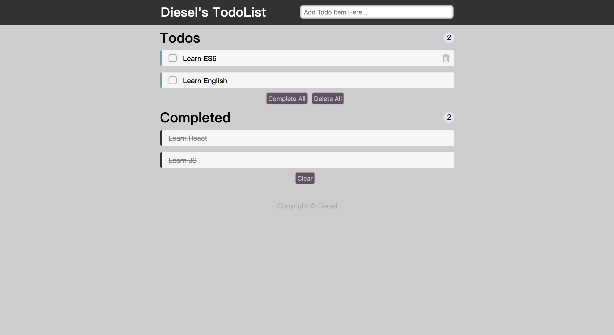

This project was bootstrapped with [Create React App](https://github.com/facebook/create-react-app).

## Available Scripts

In the project directory, you can run:

### `npm start`

Runs the app in the development mode. 
Open [http://localhost:3000](http://localhost:3000) to view it in the browser.

### Sample

### Functions

#### Input

1. 点击输入框tips自动消失，失去焦点恢复tips
2. 输入框中输入内容并回车，生成Todos list
3. 检测输入内容中的链接并展示

#### Todos

1. Todos列表有内容时动态显示
2. Todos列表右上角数字统计当前列表中items数量
3. 当items数量大于1时，显示下方的"Complete All"和"Delete All"，单击完成/删除Todos列表中的所有item
4. 点击各item前的方框，会将其设定为"完成"
5. 鼠标移入item后右侧会显示删除键，点击即可删除当前item，并更新视图状态
6. 双击item可修改item的内容，item编辑状态失去焦点和回车则修改item，通过refs拿到真实dom并更新视图；item编辑状态按下ESC键退出修改，还原数据

#### Completed

1. Completed列表有内容时动态显示
2. Completed列表右上角数字统计当前列表中items数量
3. 当items数量大于1时，显示下方的"Clear"，单击清空Completed列表
4. 点击item会将其恢复至Todos列表中
5. 鼠标移入item后右侧会显示删除键，点击即可删除当前item，并更新视图状态